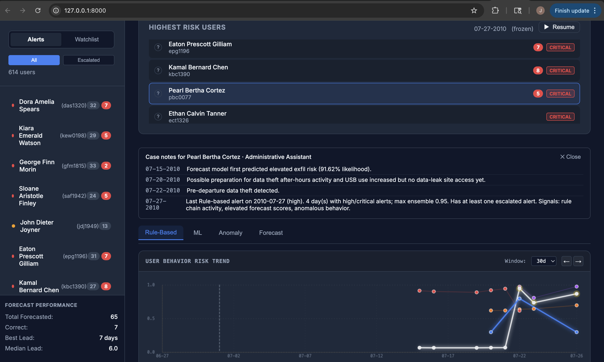
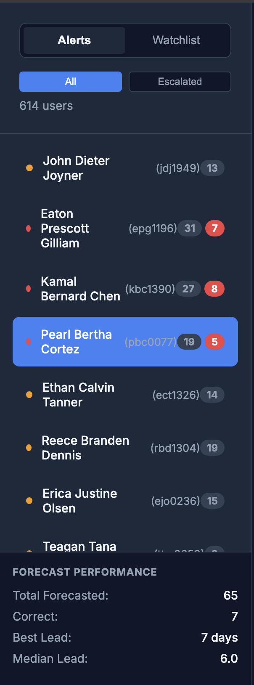

# Insider Threat Detection System

*Developed by Jakob West and Jordan Chambers  
University of Utah – Master of Software Development Capstone*

A full-stack insider threat detection system that combines rule-based detection, anomaly detection, and machine learning to identify potential data exfiltration events from enterprise activity logs.

The system includes an end-to-end data pipeline and an interactive monitoring dashboard for investigating high-risk users.

---

## Overview

This repository implements an end-to-end insider threat detection system:

- Data ingestion and normalization of enterprise activity logs  
- Feature engineering using sliding behavioral windows  
- Rule-based detection of known attack patterns  
- Anomaly detection for behavioral deviations  
- Supervised machine learning for predictive detection  
- Ensemble risk scoring  
- Interactive monitoring dashboard for investigation  

The system processes enterprise activity logs including:

- Logon events
- HTTP activity
- File transfers
- Email activity
- USB device usage
- LDAP employee records

---

## Why This Project Matters

Insider threats are difficult to detect because malicious behavior often appears normal in isolation. This system models user behavior over time using sliding windows and combines multiple detection strategies to identify subtle deviations before critical events occur.

---

## Tech Stack

- Python
- DuckDB / Parquet
- FastAPI
- scikit-learn / XGBoost

---

## Key Features

- Behavioral feature engineering using sliding time windows
- Multi-detector system (rule-based, anomaly, ML)
- Ensemble risk scoring for robust detection
- End-to-end pipeline from raw logs to UI investigation

---

## Dashboard Preview
The system includes an analyst-facing monitoring dashboard for investigating high-risk users, understanding alert timelines, and interpreting model outputs.

### Dashboard Overview
Provides a high-level view of system activity, risk trends, and active alerts.


### User Risk List
Displays users ranked by risk score, allowing analysts to quickly identify high-priority individuals.


### Behavioral Risk Timeline
Shows how user risk evolves over time across multiple detection models.


### Detection Breakdown (Rule + ML + Anomaly + Forecast)
Breaks down contributing signals from rule-based, anomaly, ML, and forecast models.


### Investigation Timeline (Case Notes)
Presents a timeline of events and analyst-readable context for investigation.


---

## System Overview

The system processes raw enterprise activity logs and transforms them into actionable alerts through a multi-stage pipeline:

1. Raw logs → cleaned and normalized event tables  
2. Behavioral features computed over time windows  
3. Detection layer (rules, anomaly detection, ML models)  
4. Ensemble scoring combines all signals  
5. Alerts generated and visualized in the dashboard  

See detailed documentation:
- [Architecture](docs/architecture.md)
- [Pipeline](docs/pipeline.md)
- [Results](docs/results.md)

---

## Quick Start

```bash
git clone https://github.com/your-username/insider-threat-detection-clean
cd insider-threat-detection-clean

python3 -m venv .venv
source .venv/bin/activate
pip install -r requirements.txt

scripts/build_all.sh
make ui
```

Then open:

http://127.0.0.1:8000

---

## Repository Structure

```
insider-threat-detection-clean
│
├── src/                Core detection system
│   ├── detector/       Rule-based detection engine
│   ├── anomaly/        Anomaly detection models
│   ├── ml/             Supervised ML models
│   ├── ui/             FastAPI + dashboard interface
│   └── run_loop.py     Main detection pipeline
│
├── scripts/            Data processing and build scripts
│   └── build_all.sh
│
├── docs/               Documentation and architecture notes
│
├── macos/              macOS launcher for the dashboard
│
├── Makefile            Project commands
├── requirements.txt
└── README.md
```

More information about specific folders:

- [`src/`](src/)
- [`scripts/`](scripts/)
- [`docs/`](docs/)

---

## Dataset

This project uses the **CERT Insider Threat Dataset (r5.2)**.

Download:

https://kilthub.cmu.edu/articles/dataset/Insider_Threat_Test_Dataset/12841247/1

After downloading and extracting the dataset, place the files in:

```
data/r5.2/
```

Example structure:

```
data/r5.2/
  LDAP/
  device.csv
  email.csv
  file.csv
  http.csv
  logon.csv
```

The `data/` directory is excluded from Git because the dataset is large.

---

## Running the Pipeline

Create a virtual environment:

```
python3 -m venv .venv
source .venv/bin/activate
```

Install dependencies:

```
pip install -r requirements.txt
```

Run the full data processing and detection pipeline:

```
scripts/build_all.sh
```

This generates derived datasets in:

```
out/
```

---

## Launching the Dashboard

Start the monitoring interface:

```
make ui
```

The dashboard will be available at:

```
http://127.0.0.1:8000
```

The dashboard allows analysts to:

- monitor high-risk users
- inspect alert timelines
- analyze behavioral trends
- understand model contributions (rule, anomaly, ML, forecast)

---

## macOS Application Launcher

This repository includes a macOS application bundle that allows you to launch the UI dashboard without using the terminal.

Copy the launcher to your Desktop:

```
cp -R macos/InsiderThreatUI.app ~/Desktop/
```

Double-click the application to:

- activate `.venv`
- run `make ui`
- open the dashboard automatically

---

## Detection Architecture

The detection system combines three approaches.

### Rule-Based Detection

Detects explicit attack sequences such as:

- USB exfiltration
- suspicious file transfers
- policy violations

Implemented in:

```
src/detector/
```

### Anomaly Detection

Behavioral deviations detected using statistical models and unsupervised learning.

Implemented in:

```
src/anomaly/
```

### Machine Learning

Supervised models trained on historical behavior patterns.

Implemented in:

```
src/ml/
```

### Ensemble Scoring

Detection signals from the rule engine, anomaly models, and ML models are combined into a unified **risk score**.

---

## Detection Performance

Performance from Scenario‑1 exfiltration detection:

| Metric | Value |
|------|------|
| Precision | 100% |
| Recall | 93% |
| Exfiltrators detected | 27 / 29 |

---

## Documentation

Additional documentation and architecture notes are available in:

- [`docs/`](docs/)

---

## Notes

- Raw `data/` and derived `out/` directories are intentionally excluded from Git.
- These artifacts can be reproduced by running the pipeline.
- Usernames are normalized to `user_key` (lowercase, no domain/email).

---

## License

This project is provided for academic and research purposes.
