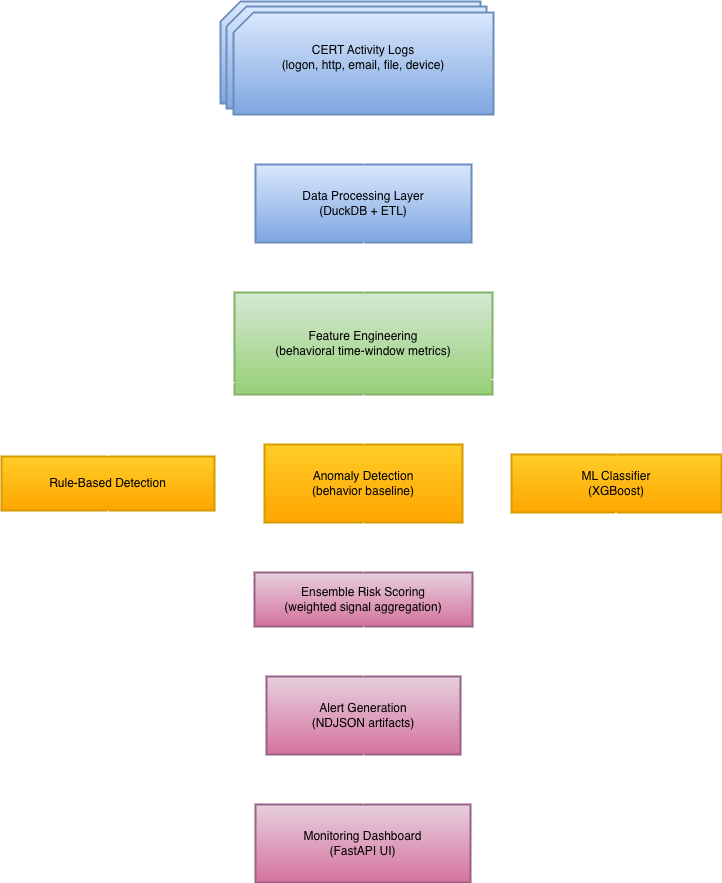

# System Architecture

This document describes the high‑level architecture of the Insider Threat Detection System.  
The system processes enterprise activity logs, generates behavioral features, applies multiple detection strategies, and surfaces alerts through a monitoring dashboard.

---

## Architecture Diagram




---

## Core System Components

### 1. Data Processing

Raw enterprise activity logs from the CERT dataset are cleaned and normalized using DuckDB‑based ETL workflows.

Responsibilities:

- ingest large log files
- normalize timestamps and user identifiers
- standardize event formats
- generate queryable analytical datasets

Output artifacts are typically stored as Parquet tables or intermediate processed datasets.

---

### 2. Feature Engineering

Behavioral features are computed from historical user activity.

These features capture patterns such as:

- abnormal login timing
- unusual browsing behavior
- suspicious file access
- deviations from historical baselines

Many features are computed using **sliding time windows** to capture behavioral trends.

---

### 3. Detection Pipeline

The system combines multiple detection strategies to identify potential insider threats.

#### Rule‑Based Detection

Deterministic rules identify known suspicious behaviors such as:

- unusual file transfers
- risky USB activity
- policy violations

These rules provide strong signals for known insider threat patterns.

---

#### Anomaly Detection

Statistical anomaly models identify deviations from historical user behavior.

These models help detect unusual activity that does not match predefined rules.

---

#### Machine Learning Detection

Supervised machine learning models (e.g., XGBoost) are trained on behavioral features derived from historical activity logs.

These models learn complex patterns associated with insider threat scenarios.

---

### 4. Ensemble Risk Scoring

Signals from the rule engine, anomaly models, and machine learning classifiers are combined to produce a **final risk score** for each user.

This ensemble approach improves robustness by leveraging complementary detection strategies.

---

### 5. Alert Generation

Users exceeding risk thresholds generate alert records.

Alerts are written as structured artifacts (for example NDJSON files) containing:

- user identifier
- timestamp
- contributing detection signals
- computed risk score

These artifacts are consumed by the investigation dashboard.

---

### 6. Monitoring Dashboard

The monitoring interface provides an interactive investigation environment.

The dashboard is implemented using a FastAPI backend with a lightweight HTML/CSS/JavaScript frontend.

Capabilities include:

- viewing high‑risk users
- inspecting generated alerts
- exploring behavioral timelines
- investigating contributing risk indicators

---

## Data Flow Summary

```
Raw Logs
↓
Cleaning
↓
Feature Engineering
↓
Detection
↓
Scoring
↓
Alerts
```

---

## Notes

The architecture was designed to emphasize:

- reproducible data pipelines
- modular detection strategies
- scalable log processing
- explainable alert generation

This design allows additional detectors or behavioral features to be integrated into the pipeline without major architectural changes.
