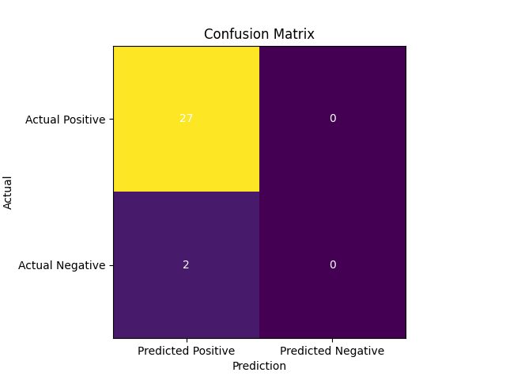
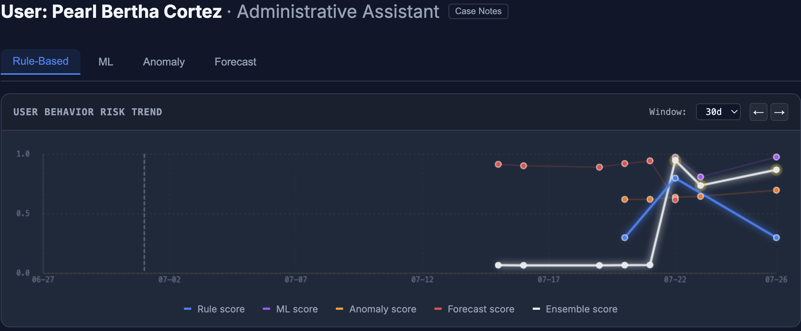
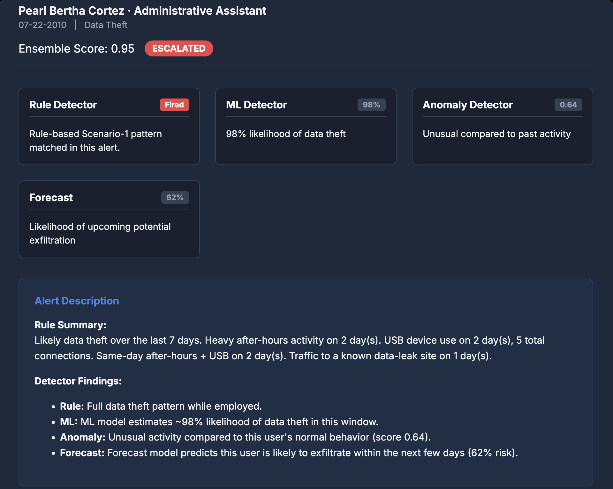
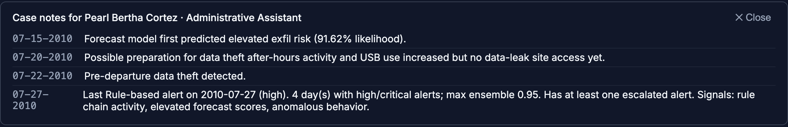

# Detection Results

This document summarizes the evaluation results of the Insider Threat Detection System when applied to the CERT Insider Threat Dataset.

The system combines rule-based detection, anomaly detection, and supervised machine learning models to identify malicious insider activity.

---

## Evaluation Scenario

The system was evaluated on insider data exfiltration scenarios contained in the CERT Insider Threat Dataset.

These scenarios simulate employees attempting to remove sensitive information from an organization through activities such as:

- abnormal file access
- unusual login behavior
- suspicious web activity
- external data transfer

The goal of the system is to detect these behaviors **before or during the exfiltration process**.

---

## Performance Metrics

The system achieved strong detection performance when combining rule-based signals with machine learning detection.

| Metric | Value |
|------|------|
| Precision | 100% |
| Recall | 93% |
| Detected Exfiltrators | 27 / 29 |

Interpretation:

- **Precision (100%)** indicates that every flagged exfiltration case corresponded to a real insider threat event.
- **Recall (93%)** indicates that the system successfully detected the majority of known insider exfiltration scenarios.

---

## Early Detection Capability

A key goal of the system is detecting suspicious behavior **before the final exfiltration event occurs**.

Machine learning models were able to identify behavioral anomalies several days prior to explicit data exfiltration in many scenarios.

This early warning capability allows analysts to investigate suspicious activity and potentially intervene before data loss occurs.

---

## Detection Pipeline Contribution

Multiple detection strategies contribute signals to the final alert scoring system.

| Detector | Purpose |
|------|------|
| Rule-Based Detection | Identifies explicit suspicious behaviors and policy violations |
| Anomaly Detection | Detects deviations from historical user behavior |
| Machine Learning Models | Learns complex behavioral patterns associated with insider threats |

These detectors operate together in an **ensemble scoring system**, which produces a final risk score for each user.

---

## Ensemble Benefits

Combining multiple detection approaches significantly improves robustness compared to using any individual model alone.

Each detection layer captures different behavioral signals:

- **Rules** capture known insider attack patterns.
- **Anomaly detection** captures deviations from normal user behavior.
- **Machine learning models** identify complex multi-signal behavioral patterns.

The ensemble approach improves recall while maintaining high precision.

---

## Analyst Investigation Workflow

Detected alerts are surfaced through the monitoring dashboard.

The dashboard allows analysts to:

- view high-risk users
- inspect triggered alerts
- analyze behavioral indicators
- review user activity timelines
- investigate contributing risk signals

---

## Summary

The insider threat detection system demonstrates strong performance on simulated insider threat scenarios using the CERT dataset.

Key takeaways:

- High precision and recall in detecting exfiltration cases
- Ability to detect suspicious activity **before final data exfiltration events**
- Robust detection through a **multi-layer ensemble pipeline**

Future improvements may include:

- expanded behavioral feature sets
- additional anomaly detection models
- improved explainability for analyst investigation
